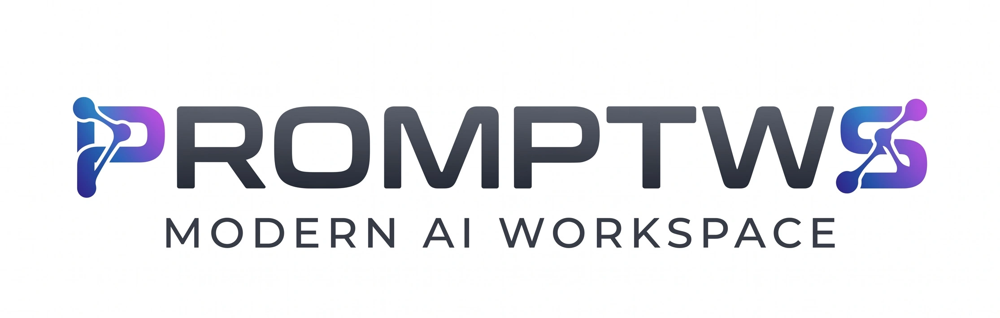

<p align="center">
  
</p>

<h1 align="center">Intelligent Prompt Workspace (PromptWS)</h1>

<p align="center">
  <strong>Transform messy ideas into structured AI-ready prompts, workflows, and tool recommendations — instantly.</strong>
</p>

<p align="center">
  <a href="https://github.com/PrashantPKP/Intelligent-Prompt-Workspace"></a>
  <a href="https://github.com/PrashantPKP/Intelligent-Prompt-Workspace/issues"></a>
  <a href="https://github.com/PrashantPKP/Intelligent-Prompt-Workspace/blob/main/LICENSE"></a>
</p>

---

## 🚀 About

**PromptWS** is an AI-powered web application that takes your raw, unstructured ideas and converts them into:

- ✅ **Structured step-by-step workflows** — complete with scripts, prompts, and upload metadata
- ✅ **Copy-paste-ready AI prompts** — optimised for tools like Midjourney, Runway ML, ElevenLabs, Suno, and 200+ others
- ✅ **Smart tool recommendations** — with pricing, links, and beginner-friendliness ratings
- ✅ **Auto-category detection** — video, image, blog, music, resume, and more
- ✅ **Alternative creative versions** and pro tips for every workflow

Whether you want to create a YouTube video, generate an AI image, write a blog post, or plan a startup — just describe your idea and PromptWS builds the entire workflow for you.

---

## ✨ Features

| Feature | Description |
|---|---|
| 🔮 **Auto-Detect Mode** | AI automatically detects the category (video, image, blog, etc.) from your description |
| 🎬 **Multi-Step Workflows** | Generates complete workflows with 3–5 structured steps (scripts, prompts, metadata) |
| 🤖 **200+ AI Tool Database** | Recommends the best AI tools with pricing, links, and quality ratings |
| 📋 **One-Click Copy** | Copy any prompt or content block with a single click |
| ⚡ **Real-Time Streaming** | Responses stream in real-time for an instant, responsive experience |
| 🔄 **API Key Rotation** | Automatic key rotation with multi-model fallback for reliability |
| 📱 **Responsive Design** | Fully responsive UI that works on desktop, tablet, and mobile |

---

## 🛠️ Tech Stack

- **Frontend**: [Next.js 16](https://nextjs.org/) · [React 19](https://react.dev/) · CSS Modules
- **Backend**: Next.js API Routes (server-side streaming)
- **AI Engine**: [Groq](https://groq.com/) (Llama 3.3 70B, Llama 4 Scout, Qwen3 32B)
- **Language**: JavaScript (ES Modules)

---

## 📦 Getting Started

### Prerequisites

- **Node.js** 18+ and **npm**
- A free **Groq API key** — [Get one here](https://console.groq.com/keys)

### Installation

```bash
# 1. Clone the repository
git clone https://github.com/PrashantPKP/Intelligent-Prompt-Workspace.git
cd Intelligent-Prompt-Workspace

# 2. Install dependencies
npm install

# 3. Set up environment variables
cp .env.example .env.local
# Open .env.local and add your Groq API key(s)

# 4. Start the development server
npm run dev
```

Open [http://localhost:3000](http://localhost:3000) to see the app.

### Environment Variables

| Variable | Required | Description |
|---|---|---|
| `GROQ_API_KEY_1` | ✅ Yes | Your primary Groq API key |
| `GROQ_API_KEY_2` … `GROQ_API_KEY_12` | ❌ Optional | Additional keys for automatic rotation & rate-limit handling |

> **Note:** You can add up to 12 API keys. The app automatically rotates through them when rate limits are hit.

---

## 🎯 How It Works

1. **Describe your idea** — Type what you want to create in natural language
2. **Pick a category** (optional) — Or let the AI auto-detect it
3. **Get your workflow** — Receive structured steps with:
   - `[CONTENT]` steps: actual written content (scripts, bios, emails)
   - `[PROMPT]` steps: copy-paste prompts for AI tools (Midjourney, Runway, etc.)
4. **Copy & create** — Use the one-click copy buttons and paste into the recommended AI tools

---

## 🤝 Contributing

Contributions are welcome! Feel free to:

1. Fork the repository
2. Create a feature branch (`git checkout -b feature/amazing-feature`)
3. Commit your changes (`git commit -m 'Add amazing feature'`)
4. Push to the branch (`git push origin feature/amazing-feature`)
5. Open a Pull Request

---

## 👨‍💻 Developer

**Prashant Parshuramkar**

[](https://github.com/PrashantPKP)
[](https://www.linkedin.com/in/prashantpkp/)

---

## 📄 License

This project is open source and available under the [MIT License](LICENSE).

---

<p align="center">
  Made with ❤️ by <a href="https://github.com/PrashantPKP">Prashant Parshuramkar</a>
</p>
